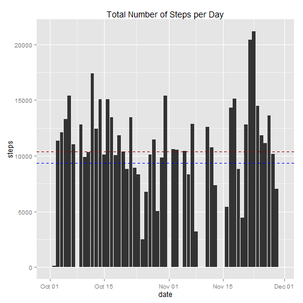
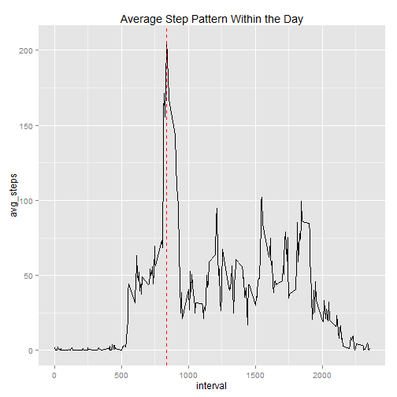
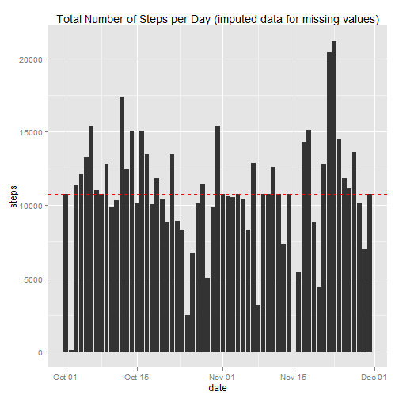
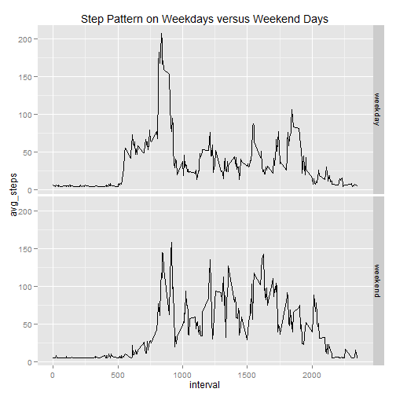

Please refer to the readme document in this repository for details on the 
assignment. 

### Loading and preprocessing the data

Data is loaded in raw csv format and then transformed to ensure the dates are in
the correct format and the time intervals are factors for ease of analysis.


```r
## Load in the necessary libraries
library(dplyr)
library(ggplot2)
library(lubridate)

## Unzipping file and reading into r
unzip("activity.zip")
activity <- read.csv("activity.csv")

## Formatting dates and turning day intervals into factors
activity$date <- ymd(activity$date)
activity$interval <- as.factor(activity$interval)
```

### What is mean total number of steps taken per day?

By examining a histogram of the total number of steps taken per day, overlaid with the
mean and median number of steps per day a certain level of consistency is observed
around the ten thousand step mark.


```r
## Create a summary of the data summing steps by day

datesum <- summarize(group_by(activity, date), sum(steps, na.rm = TRUE))
names(datesum)[2] <- "steps"

## Calculate mean and median of the steps taken per day
meansteps <- as.integer(mean(datesum$steps))
mediansteps <- median(datesum$steps)

## Plot the histogram of total steps per day
dateplot <- qplot(date, steps, data = datesum, 
                  geom = "histogram", 
                  stat = "identity", 
                  main = "Total Number of Steps per Day")

## Add mean and median lines to the plot

dateplot <- dateplot + geom_hline(aes(yintercept=meansteps),
                                  colour = "blue",
                                  linetype = "dashed")
dateplot <- dateplot + geom_hline(aes(yintercept=mediansteps), 
                                  colour = "#990000", 
                                  linetype = "dashed")
print(dateplot)
```

 

- The <span style="color:blue"> mean number </span> of steps taken per day is: 9354

- The <span style="color:red"> median number </span> of steps taken per day is: 10395

### What is the average daily activity pattern?

The line chart shows a step count peak about a third of the way through each day.
Approximately 8:30 AM. Additional analysis would be required to determine potential causation. 


```r
## Create a summary of the data averaging steps by interval

intsum <- summarize(group_by(activity, interval), mean(steps, na.rm = TRUE))
names(intsum)[2] <- "avg_steps"
intsum$interval <- as.integer(as.character(intsum$interval))

## Find the max number of steps and the interval that contains it within the day
maxsteps <- max(intsum$avg_steps)
maxinterval <- filter(intsum, avg_steps == maxsteps)
maxinterval <- as.character(maxinterval[,1])
maxstepsasint <- as.integer(maxsteps) #Changed format for use in report
        
## Plot the line of total steps per day
intplot <- qplot(interval, avg_steps, data = intsum, 
                  geom = "line",
                  stat = "identity",
                  main = "Average Step Pattern Within the Day")

## Add Maximum line to the plot

intplot <- intplot + geom_vline(aes(xintercept=as.integer(maxinterval)),
                                  colour = "red",
                                  linetype = "dashed")
print(intplot)
```

 

- The Interval containing the <span style="color:red"> Maximum Number </span> of
average steps within the day is interval 835 with 206 steps.
This clearly shows that the highest number of steps are taken in the early 
morning. 

### Imputing missing values


```r
## Counting number of NAs in activity data set
missingcount <- sum(is.na(activity))
```

In the original activity data set there were 2304 missing values in 
the steps column. 


```r
## Copying activity data and imputing missing values based on average number of
## steps in every interval

imputeddata <- activity
imputeddata[is.na(imputeddata)] <- mean(imputeddata$steps, na.rm = TRUE)

## Create a summary of the data summing steps by day

newdatesum <- summarize(group_by(imputeddata, date), sum(steps, na.rm = TRUE))
names(newdatesum)[2] <- "steps"

## Calculate mean and median of the steps taken per day and the variance to the 
## original mean and median

newmeansteps <- as.integer(mean(newdatesum$steps))
newmediansteps <- median(newdatesum$steps)

meanvar <- as.integer(newmeansteps - meansteps)
medianvar <- as.integer(newmediansteps - mediansteps)
```

I chose to use the average steps at the interval level to impute missing values. 
This decision was based on it being the lowest common denominator in the data set.
By using the average interval level step count to replace NA values, the mean has
increased by 1412 and the median by 371.


```r
## Plot the histogram of total steps per day
newdateplot <- qplot(date, steps, data = newdatesum, 
                  geom = "histogram", 
                  stat = "identity", 
                  main = "Total Number of Steps per Day (imputed data for missing values)")

## Add mean and median lines to the plot (mean and median the same in this instance)

newdateplot <- newdateplot + geom_hline(aes(yintercept=newmeansteps), 
                                  colour = "red", 
                                  linetype = "dashed")
print(newdateplot)
```

 

- Both the <span style="color:red"> mean and median number </span> of steps taken
per day is: 10766. Overall this does not seem to negatively impact 
the data set, or to greatly change its shape. 


### Are there differences in activity patterns between weekdays and weekends?

By splitting the week into two parts, weekday and weekend, it starts to provide
the beginnings of a hypothesis regarding the high number of steps taken early-morning.


```r
## Initializing the weekend data frame and setting index

weekenddata <- mutate(imputeddata, weekpart = "")
weekendindex <- weekdays(imputeddata$date)=="Saturday" | weekdays(imputeddata$date)=="Sunday"


## Updating the new column with the appropriate week part

for(i in 1:nrow(imputeddata)){
        
        if(weekendindex[i] == TRUE)
                
                weekenddata[i,"weekpart"] <- "weekend"
        
        else
                weekenddata[i,"weekpart"] <- "weekday"            
}

## Formatting week part to factor for analysis
weekenddata$weekpart <- as.factor(weekenddata$weekpart)


## Creating data subsets for plot
weekpartplotdata <- summarize(group_by(weekenddata, interval, weekpart), mean(steps, na.rm = TRUE))
names(weekpartplotdata)[3] <- "avg_steps"
weekpartplotdata$interval <- as.integer(as.character(weekpartplotdata$interval))

## Average number of steps on weekend versus weekday for report
avgstepsperweekpart <- summarize(group_by(weekpartplotdata, weekpart), mean(avg_steps))
maxstepsperweekpart <- summarize(group_by(weekpartplotdata, weekpart), max(avg_steps))

weekendavg <- as.integer(avgstepsperweekpart[2,2])
weekdayavg <- as.integer(avgstepsperweekpart[1,2])
weekendmax <- as.integer(maxstepsperweekpart[2,2])
weekdaymax <- as.integer(maxstepsperweekpart[1,2])
```

With the max number of steps being 207 on weekdays and 157
on weekends, it is clear that people hit a higher maximum on typical work days.
Likely during the morning commute. However, overall the average number of steps 
taken is higher on weekends (35 / weekday versus 42
/weekend day respectively). 


```r
## Creating the line plots for weekend versus weekday steps
weekplot <- qplot(interval, avg_steps, 
                  data = weekpartplotdata, 
                  geom = "line",
                  stat = "identity",
                  main = "Step Pattern on Weekdays versus Weekend Days")

weekplot <- weekplot+facet_grid(weekpart ~ .)

print(weekplot)
```

 

This would indicate higher peaks of activity during the work week but overall higher 
activity levels on the weekend. This short exercise shows the inherent value of 
examining the data from many angles. It would be useful in the future to identify holidays or other similar periods to see if they follow similar patterns as weekend activity and add more fuel to this hypothesis. 
